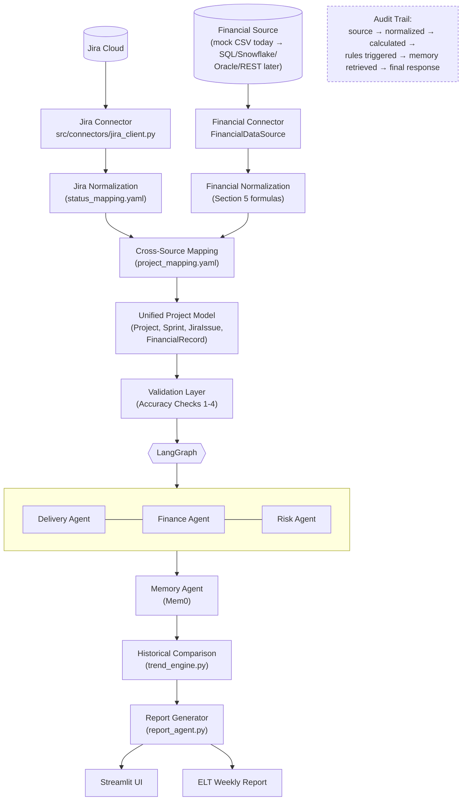

# ELT Portfolio Intelligence Agent — Architecture (Phase 1)

## 1. Scope of this document

This covers Phase 1 only: architecture, data model, LangGraph state design,
repo skeleton, and sample data/report. No connector, agent, or graph logic is
implemented yet — every runnable node in `src/graph/nodes.py` currently
raises `NotImplementedError` on purpose, with a docstring naming the phase
that fills it in.

## 2. Why this shape

The core constraint driving every decision below is Section 13's accuracy
framework: **the LLM explains, Python calculates.** That single rule forces
a specific architecture:

- Jira and Finance must be normalized into one shape (`Project`) *before*
  anything touches an LLM, so there is a single, typed place to validate.
- Every number in a report must be traceable back to a `SourceProvenance`
  record — which means normalization can't discard the source record id/
  timestamp on the way through.
- Historical claims ("stuck for 3 sprints") require stored history, not
  LLM inference over a single snapshot — which is why Mem0 sits *before*
  risk analysis in the graph, not after: risk analysis needs
  `historical_context` to decide `sprint_count_blocked`.
- A validation node has to run *after* all analysis but *before* the LLM
  writes anything, so a failed check can downgrade confidence rather than
  let an ungrounded claim reach an executive.

## 3. Architecture diagram



## 4. Component responsibilities

| Component | Responsibility | Must NOT do |
|---|---|---|
| `jira_client.py` | Pull raw issues/sprints/projects from Jira Cloud REST, apply `status_mapping.yaml` | Compute risk, story-point math, or drop malformed records silently |
| `financial_client.py` (`FinancialDataSource`) | Abstract "get finances for a project/portfolio" behind one interface | Let any caller depend on a concrete adapter (`MockFinancialDataSource` etc.) directly |
| Cross-source mapping (`project_mapping.yaml`) | Resolve a Jira project and a finance project to one `Project.project_id` | Guess a mapping from name similarity — an unmapped project is `UNKNOWN`, never inferred |
| Validation layer (`services/reconciliation.py`) | Accuracy Checks 1, 2, 3, 4 on raw + normalized data | Fill in a missing value with a guess instead of a sentinel |
| Delivery Agent | Sprint/blocker facts + delivery risk classification | Touch financial figures |
| Finance Agent | Budget facts + financial risk classification | Touch Jira issue state |
| Risk Agent | Cross-domain matrix (Section 10) | Overwrite the delivery/financial risk objects it combines |
| Memory Agent (Mem0) | Store/retrieve normalized `ProjectSnapshot` facts, scoped by `organization_id/portfolio_id/project_id` | Store raw Jira/Finance payloads |
| Report Generator | Narrate calculated metrics + risks + history into Section 15's format, with citations | Perform or restate a calculation the LLM invented itself |
| Streamlit UI | Present the above, filterable (Section 16) | Call Jira/Finance directly — always goes through the graph/services layer |

## 5. LangGraph state design

See `src/graph/state.py` for the authoritative, type-annotated version. Key
design choices:

- **TypedDict, not BaseModel**, because LangGraph's reducer mechanism
  (`Annotated[list[X], add]`) is built around TypedDict state and per-key
  merge functions. The values inside each key are still Pydantic models —
  typing isn't lost, just moved one level down.
- **Ownership rule**: a node may only add new keys or append to list keys it
  owns (`risks`, `citations`, `*_validation`). No node is allowed to mutate a
  fact a previous node wrote — e.g. `analyze_financial_risk` reads
  `calculated_metrics` and appends to `risks`, but never edits
  `financial_data`. This directly implements Section 7's "Do not allow
  agents to silently overwrite factual values retrieved from source
  systems."
- **`historical_context` is always a dict**, even when Mem0 has nothing —
  empty `{}`, not a missing key — so "no history yet" and "not fetched yet"
  are never confused by a later node checking `"historical_context" in
  state`.
- **`sprint_count_blocked` / trend direction are `Optional` on purpose**:
  Accuracy Check 6 requires ≥2 stored snapshots before either can be
  anything other than `None` / `BASELINE`. The type system reflects that a
  first-ever report genuinely cannot answer "stuck for how many sprints?".

## 6. Data model

Implemented in `src/models/` (`Project`, `Sprint`, `JiraIssue`,
`FinancialRecord`, `ProjectSnapshot`, `Risk`, plus shared enums and
`SourceProvenance` in `common.py`) — exactly the fields Section 3 specifies.
One deliberate refinement: numeric fields stay `Optional[float] = None`
rather than ever holding the literal strings `"UNKNOWN"` / `"NOT AVAILABLE"`
/ `"NOT MAPPED"`. Those sentinels are real and required by Section 13, but
are rendered at the display layer (`services/reconciliation.py`,
Phase 11) — see the docstring in `src/models/common.py` for the reasoning.

## 7. Repository structure

```
devOps_week3_ELT/
├── notebooks/                  # 01 created; 02-15 land with their phase (see notebooks/README.md)
├── app/
│   ├── streamlit_app.py
│   └── pages/                  # created in Phase 10
├── src/
│   ├── agents/                 # delivery, finance, risk, memory, validation, report
│   ├── connectors/             # jira_client.py, financial_client.py
│   ├── graph/                  # state.py, nodes.py, workflow.py
│   ├── models/                 # project, sprint, issue, finance, snapshot, risk, common
│   ├── services/                # metrics, risk_engine, trend_engine, reconciliation
│   └── utils/                  # logging.py
├── tests/                      # see tests/README.md
├── config/
│   ├── risk_rules.yaml
│   ├── project_mapping.yaml
│   └── status_mapping.yaml
├── data/
│   ├── sample/                 # jira_mock_data.csv, financial_mock_data.csv (canonical Phase 1 fixtures)
│   └── snapshots/               # ProjectSnapshot history lands here / in Mem0, Phase 7
├── docs/
│   └── sample_expected_elt_report.md
├── .env.example
├── .gitignore
├── requirements.txt
├── architecture.md
└── README.md
```

## 8. Sample data (Section 25)

`data/sample/` is a copy of the mock data already in this repo
(`jira_mock_data.csv`: 265 issues across 5 projects, 3-5 sprints each;
`financial_mock_data.csv`: 40 monthly financial records, Jan-Aug 2026 for
the same 5 projects), plus one supplemental addition made only in the copy:
5 extra issues for a 6th project, **QSR / Quasar Self-Service Analytics**,
which exists in Jira but is deliberately *not* listed in
`project_mapping.yaml`'s finance mapping. This gives Phase 1 sample data
that already exercises, without any invented numbers:

| Required test scenario (Section 25) | Where it comes from in the real data |
|---|---|
| Schedule-stressed project | ORCA/NOVA/TITAN/LYNX last-sprint completion 29-48% |
| Financially stressed project | All 5 mapped projects run 91-112% of approved budget through Q1 2026 |
| Blocked project | 38 issues across the dataset carry `blocker_status = Blocked`; several are 40-70+ days old by the report date |
| Project missing financial mapping | QSR — Jira-only, `finance_project_id: null` |
| Stale data (freshness check) | PHX/ORCA/NOVA's last sprint ended 2026-02-15 (~28 days before the report date below); TITAN/LYNX's ended 2026-03-15 (same day) |
| Data-quality inconsistency | `PHX-4` is `blocker_status = Blocked` while its workflow `status = In Review` — a real inconsistency in the source data, not invented, that the validation layer is expected to surface rather than silently resolve |
| Healthy/GREEN project | QSR's own delivery numbers (4/5 issues Done/Closed) — paired with an UNKNOWN financial status rather than a clean GREEN, since it isn't mapped |

Week-over-week trend and multi-sprint blocker persistence (Sections 12, 14)
are **not** faked with invented prior-week numbers — Accuracy Check 6
requires real stored history, which doesn't exist until Phase 7 writes the
first `ProjectSnapshot`. The sample report below states this explicitly
(`BASELINE`) rather than showing a fabricated trend.

## 9. Known data caveat, logged rather than hidden

The financial CSV's `committed_cost` column is consistently larger than
`actual_cost` by an amount similar in scale to `approved_budget` itself,
which — combined with Section 5's literal formula
(`remaining = approved - actual - committed`) — produces deeply negative
`remaining_budget` for every mapped project. This is presented as-is rather
than "corrected": it is realistic (a genuinely over-committed portfolio is a
real state of the world an ELT needs to see), and it is exactly the kind of
number the Financial Reconciliation check (Accuracy Check 4, Phase 11) exists
to flag with evidence — not something the normalizer should quietly clamp to
zero.
